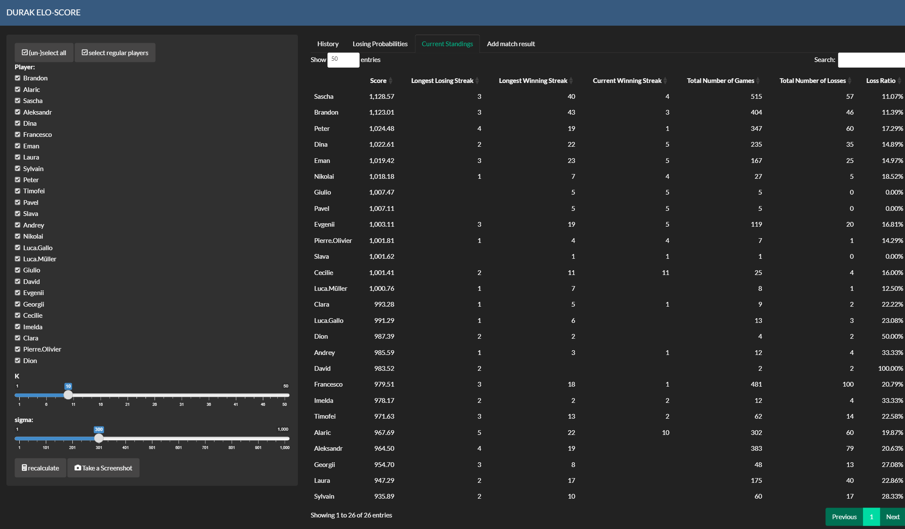

# Durak - Elo Computation

**Durak** is an Elo computation project, inspired by its application in chess. This version adapts the Elo model for multi-player games.

## Table of Contents
1. [Background](#background)
2. [Elo Calculation](#elo-calculation)
    1. [Update Rule](#update-rule)
    2. [Probability Calculation](#probability-calculation)
3. [References](#references)

## Background
This project is based on the Elo rating system as applied to chess. For further understanding, refer to the following resources:
- [The Rating of Chessplayers, Past and Present](https://gwern.net/doc/statistics/order/comparison/1978-elo-theratingofchessplayerspastandpresent.pdf)
- [True Skill(TM): A Bayesian Skill Rating System](https://www.microsoft.com/en-us/research/wp-content/uploads/2007/01/NIPS2006_0688.pdf)

## Elo Calculation
This is a brief summary of the formula we are using for the Elo computation.

### Laters Results



### Update Rule
The result of a match is decoded by assigning `1` to the loser and `0` to the winner(s)/non-loser(s). After every match, every player's score updates according to this formula:
```
new_score = old_score + K*(expected_result - result)
```
where we fix `K = 32`. The `expected_result` is equal to the losing probability, i.e., some value between 0 and 1.

### Probability Calculation
`X_i - X_j < 0` event is normally distributed with mean `m_i = mu_i - mu_j` and variance `2*sigma^2`. Here `X_i` and `X_j` describe players' performance which are independent normal distributions around their Elo-scores `mu_i` and `mu_j` with standard deviation fixed at `sigma = 200`. The losing probability is calculated using the cumulative distribution function (cdf) `F` of a n-dimensional multivariate normal distribution.

The necessary matrix (`S`) for this calculation has diagonal entries `2*sigma^2` and all other entries `sigma^2`.

## References
- [The Rating of Chess players](https://gwern.net/doc/statistics/order/comparison/1978-elo-theratingofchessplayerspastandpresent.pdf)
- [True Skill(TM)](https://www.microsoft.com/en-us/research/wp-content/uploads/2007/01/NIPS2006_0688.pdf)
